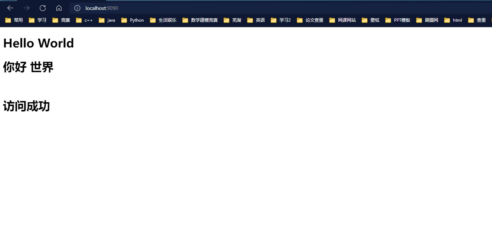
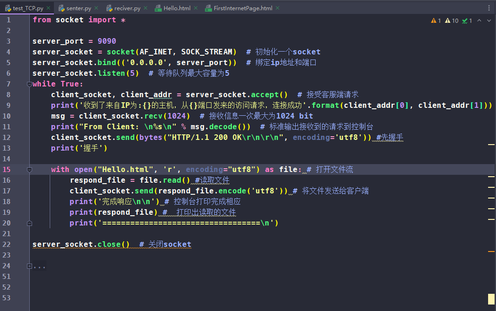
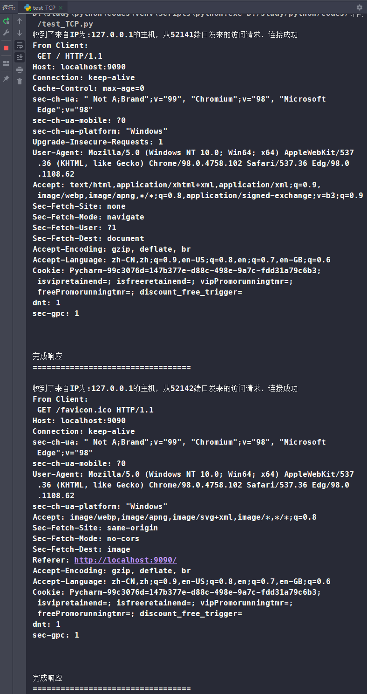

#### Chapter 2 Problem 6

+ question:

    Obtain the HTTP/1.1 specification (RFC 2616). Answer the following questions:

    a. Explain the mechanism used for signaling between the client and server to indicate that a persistent connection is being closed. Can the client, the server, or both signal the close of a connection?
    
    b. What encryption services are provided by HTTP?
    
    c. Can a client open three or more simultaneous connections with a given server?
    
    d. Either a server or a client may close a transport connection between them if either one detects the connection has been idle for some time. Is it possible that one side starts closing a connection while the other side is transmitting data via this connection? Explain

+ Answer:
    + a) Persistent connections are discussed in section 8 of RFC 2616 (the real purpose of this question is to let you retrieve and read an RFC). Sections 8.1.2 and 8.1.2.1 of the RFC state that either a client or a server can indicate to the other that it will close a persistent connection. It does this by including the connection token "close" in the connection header field of the HTTP request/reply. 
    + b) HTTP does not provide any encryption services. 
    + c) Clients using persistent connections should limit the number of simultaneous connections they maintain to a given server. A single user client should not maintain more than two connections to any server or agent. 
    + d) yes.  The client may start sending new requests at the same time as the server decides to close the "idle" connection. From the server's point of view, the connection is closed when idle, but from the client's point of view, the request is in progress.


#### Chapter 2 Problem 6

+ question:

    Write a simple TCP program for a server that accepts lines of input from a client and prints the lines onto the server’s standard output. (You can do this by modifying the TCPServer.py program in the text.) Compile and execute your program. On any other machine that contains a Web browser, set the proxy server in the browser to the host that is running your server program; also configure the port number appropriately. Your browser should now send its GET request messages to your server, and your server should display the messages on its standard output. Use this platform to determine whether your browser generates conditional GET messages for objects that are locally cached.

+ Answer:

    + TCP program:

        ```python
        from socket import *
        
        server_port = 9090
        server_socket = socket(AF_INET, SOCK_STREAM)  # 初始化一个socket
        server_socket.bind(('0.0.0.0', server_port))  # 绑定ip地址和端口
        while True:
            server_socket.listen(5)  # 等待队列最大容量为5
            client_socket, client_addr = server_socket.accept()  # 接受客服端请求
            print('收到了来自IP为:{}的主机，从{}端口发来的访问请求，连接成功'.format(client_addr[0], client_addr[1]))
            msg = client_socket.recv(1024)  # 接收信息一次最大为1024 bit
            print("From Client:\n %s\n" % msg.decode())  # 标准输出接收到的请求到控制台
            client_socket.send(bytes("HTTP/1.1 200 OK\r\n\r\n", encoding='utf8')) #先握手
        
            with open("Hello.html", 'r', encoding="utf8") as file: # 打开文件流
                respond_file = file.read() #读取文件
                client_socket.send(respond_file.encode('utf8')) # 将文件发送给客户端
                print('完成响应') # 控制台打印完成相应
                print('==================================\n')
        
        server_socket.close()  # 关闭socket
        
        
        # 收到了来自IP为:127.0.0.1的主机，从56131端口发来的访问请求，连接成功
        # From Client:
        # GET / HTTP/1.1
        # Host: localhost:9090
        # Connection: keep-alive
        # Cache-Control: max-age=0
        # sec-ch-ua: " Not A;Brand";v="99", "Chromium";v="98", "Microsoft Edge";v="98"
        # sec-ch-ua-mobile: ?0
        # sec-ch-ua-platform: "Windows"
        # Upgrade-Insecure-Requests: 1
        # User-Agent: Mozilla/5.0 (Windows NT 10.0; Win64; x64) AppleWebKit/537.36 (KHTML, like Gecko) Chrome/98.0.4758.102 Safari/537.36 Edg/98.0.1108.62
        # Accept: text/html,application/xhtml+xml,application/xml;q=0.9,image/webp,image/apng,*/*;q=0.8,application/signed-exchange;v=b3;q=0.9
        # Sec-Fetch-Site: none
        # Sec-Fetch-Mode: navigate
        # Sec-Fetch-User: ?1
        # Sec-Fetch-Dest: document
        # Accept-Encoding: gzip, deflate, br
        # Accept-Language: zh-CN,zh;q=0.9,en-US;q=0.8,en;q=0.7,en-GB;q=0.6
        # Cookie: Pycharm-99c3076d=147b377e-d88c-498e-9a7c-fdd31a79c6b3
        # dnt: 1
        # sec-gpc: 1
        # 
        # 
        # 完成响应
        # ==================================
        
        # 收到了来自IP为:127.0.0.1的主机，从56165端口发来的访问请求，连接成功
        # From Client:
        # GET /favicon.ico HTTP/1.1
        # Host: localhost:9090
        # Connection: keep-alive
        # sec-ch-ua: " Not A;Brand";v="99", "Chromium";v="98", "Microsoft Edge";v="98"
        # sec-ch-ua-mobile: ?0
        # User-Agent: Mozilla/5.0 (Windows NT 10.0; Win64; x64) AppleWebKit/537.36 (KHTML, like Gecko) Chrome/98.0.4758.102 Safari/537.36 Edg/98.0.1108.62
        # sec-ch-ua-platform: "Windows"
        # Accept: image/webp,image/apng,image/svg+xml,image/*,*/*;q=0.8
        # Sec-Fetch-Site: same-origin
        # Sec-Fetch-Mode: no-cors
        # Sec-Fetch-Dest: image
        # Referer: http://localhost:9090/
        # Accept-Encoding: gzip, deflate, br
        # Accept-Language: zh-CN,zh;q=0.9,en-US;q=0.8,en;q=0.7,en-GB;q=0.6
        # Cookie: Pycharm-99c3076d=147b377e-d88c-498e-9a7c-fdd31a79c6b3
        # dnt: 1
        # sec-gpc: 1
        # 
        # 
        # 完成响应
        # ==================================
        ```
    
    + Because the GET messages treats the cached objects as the return result of the request, so there are not GET messages for objects that are locally cached.







