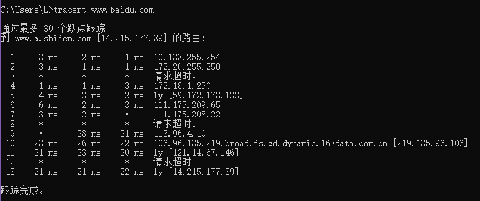

# School of Computer science, Wuhan University

# Lab report

## Course Title: Computer Networking

## Major & Grade: Software Engineering & 20

## Name: Yun Lei (雷云)

## Student ID: 2020302111256

## Collaborator: no

## Laboratory term: 2022 year spring term

## Class hours: 48h  Lab hours: 24h

## 2022-02-20

## content

[TOC]

## First Homework

### Lab 1: ping another computer

+ Lab aim: ping another computer and study how to use the "ping" command
+ Lab environment:  widows computer cmd
+ Lab content: ping my friend computer
+ Lab result: see the picture

Summary:

+ Ping results show that my local host can connect to my friend's computer and successfully exchange packets with his computer

+ The number of ping operations is the default four. All four attempts are successful without packet loss

+ The shortest time is the first time: 57ms; The longest time is the second time: 171ms; The average time of four times is 100ms

    

### Lab 2: tracert to a server

+ Lab aim: tracert to a server and study how to use the "tracert" command
+ Lab environment:  widows computer cmd
+ Lab content: ping my friend computer
+ Lab result: see the picture

Summary:

+ The first hop was found to be the gateway of the host
+ When I accessed the server of www.baidu.com from my host, I went through these 13 hops to reach the server address I needed to access
+ The three times under a hop indicate the response time of the three TTL packets sent at one time to the hop. Usually, the three times are close
+ \* indicates that the response times out. When all three packets respond to timeout, the hop will be replaced and another route will be selected to reach the destination address
