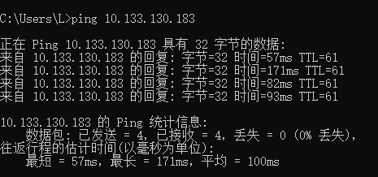
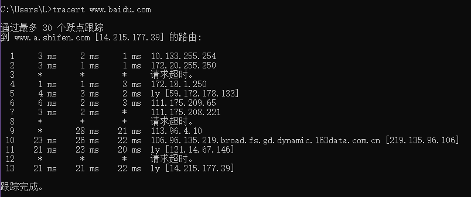

### 任务1: ping另外一台计算机

+ ping朋友的电脑ip地址

    

    

    实验报告:

    + ping的结果来看, 我的本地主机**可达**朋友的计算机, 与他的计算机成功的交换了数据包
    + ping的次数是默认的4次, 4次都成功了, 没有发生丢包
    + 耗时最短的是第1次: 57ms; 耗时最长的是第2次: 171ms; 4次的平均耗时是100ms

### 任务2: tracert 一个服务器

+ 追踪访问百度服务器的路由路径

实验报告: 

+ 发现第一个跃点正好是主机的网关
+ 从我的主机访问百度服务器的时候经过了这13个跃点到达了需要访问的服务器地址
+ 一个跃点下的三个时间表示一次性发出的3个TTL包到该跃点分别的响应时间, 通常三个时间是相近的
+ *表示响应超时, 当3个包都响应超时的情况下, 将会更换跃点, 选择其他的路线前往目标地址